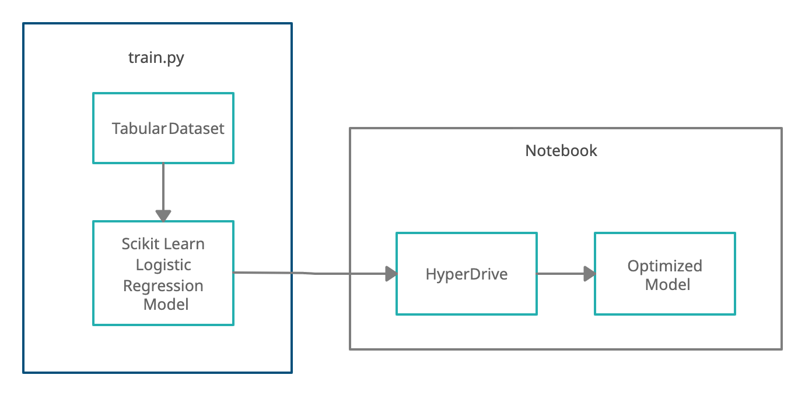
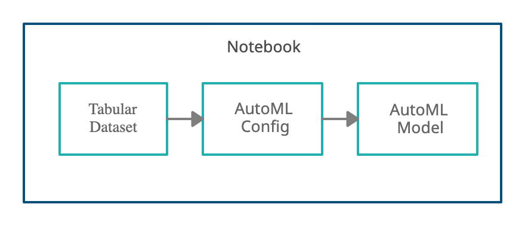

# Optimizing an ML Pipeline in Azure

## Overview
This project is part of the Udacity Azure ML Nanodegree.
In this project, we build and optimize an Azure ML pipeline using the Python SDK and a provided Scikit-learn model.
This model is then compared to an Azure AutoML run.

## Summary
The dataset used for this project is the [Bank Marketing Dataset](https://archive.ics.uci.edu/ml/datasets/Bank+Marketing) available in the UCI Machine Learning Repository. This dataset contains bank marketing data pertaining to 32950 people. The aim of the project is to predict if a client will subscribe to the service or not. This classification task makes the prediction based on several parameters including age of the customer, their marital status, the campaign number, loan status, their education details, etc. 

Two models were trained in this project; one based on Scikit-learn's linear regression with hyperparameter tuning using HyperDrive and one was an AutoML based model.The Scikit-Learn model (accuracy-0.91790) performed better than the AutoML model (accuracy- 0.91745) with a slim margin based on the model accuracy which was the chosen primary metric for optimization.

## Scikit-learn Pipeline

The following diagram demonstrates the Scikit Learn Pipeline with hyperparameter tuning using Hyperdrive- 

The Scikit-learn model is a Logistic Regression Model which is trained using a custom coded script- train.py. First the dataset is fetched from the provided url as a TabularDataset. It is then cleaned and one hot encoding is performed on the data. The hyperparameters chosen for the Scikit-learn model are regularization strength (C) and max iterations (max_iter) and are tuned using HyperDrive. Finally the trained model is scored against 20% data selected from the original dataset. The hyperparameter tuning using HyperDrive requires several steps- Defining parameter search space, defining a sampling method, choosing a primary metric to optimize and selecting an early stopping policy. 

The parameter sampling method used for this project is Random Sampling. It randomly selects the best hyperparameters for the model, that way the entire search space does not need to be searched. The random sampling method saves on time and is a lot faster than grid sampling and bayesian sampling which are recommended only if you have budget to explore the entire search space.

The early stopping policy used in this project is Bandit Policy which is based on a slack factor (0.1 in this case) and an evaluation interval (1 in this case). This policy terminates runs where the primary metric is not within the specified slack factor as compared to the best performing run. This would save on time and resources as runs which won't potentially lead to good results would be terminated early.

## AutoML

The following diagram demonstrates the AutoML Pipeline- 

AutoML searched for several algorithms to find which would perform best in this particular use case, several algorithms including LogisticRegression, SVM, Random Forest, MinMaxScaler, MaxAbsScaler, XGBoostClassifier, VotingEnsemble, etc were explored. The algorithm that performed the best was VotingEnsemble with an accuracy of 0.91745. AutoML automatically selected the best hyperparameters for the model training. AutoML automatically selects the algorithm and associated hyperparameters, the sampling policy, as well as the early stopping policy. It also selects algorithms that are blacklisted or won't work in that particular case (TensorFlowLinearClassifier and TensorFlowDNN in this case).

## Pipeline comparison
Out of the two models the Scikit-learn based Logistic Regression with hyperparameter tuning using HyperDrive performed only slightly better than the AutoML model. However the AutoML model took a lot less time than the hyperdrive run. The HyperDrive run was able to search for the optimal hyperparameters that led to good results in this case, however limiting to a single algorithm does not guarantee the best result each time. Therefore, AutoML can potentially lead to better results by exploring several potential algorithms and hyperparameter values. Also AutoML automatically selects the sampling policy as well as the early stopping policy as opposed to HyperDrive which reduces the work for the data scientist working on the problem.

## Future work
Some areas of improvement for future experiments using HyperDrive include selecting different sampling methods and early_stopping policies as well as increasing the number of total runs. Selecting a different sampling method (as opposed to Random Sampling in this case) can lead to a more exhaustive search of the search space which can potentially give us a better result. For AutoML, future experiments can explore having a experiment timeout time of more than 30 minutes, this can lead to a more exhaustive search and potentially better results. 

## Proof of cluster clean up

